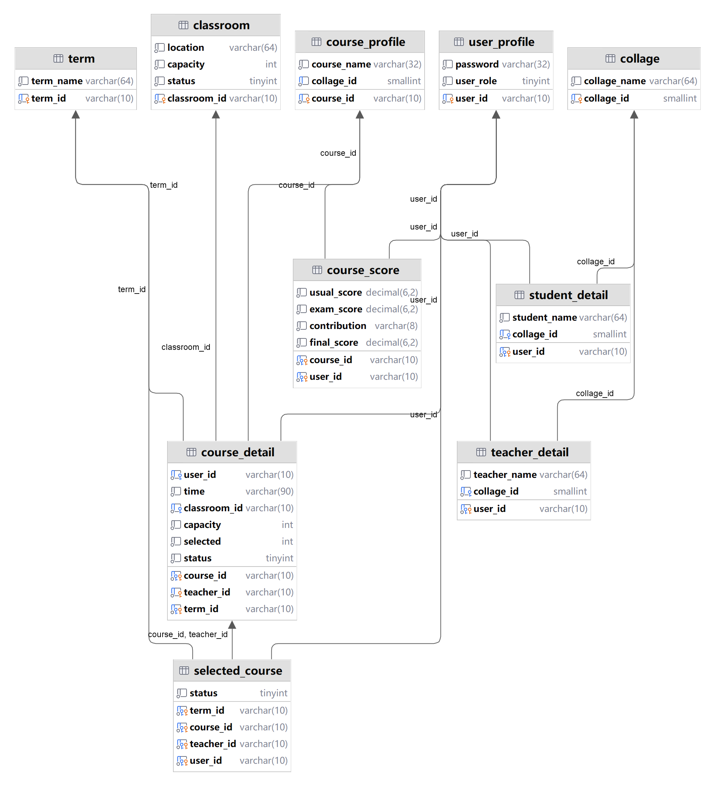

# 使用方法
1. 启动 app.py
2. 在frontend文件夹下打开cmd，输入 npm run serve
3. 打开浏览器，输入localhost:8080即可使用

# 数据库结构
## 教室表
create table coursesystem.classroom
(
    classroom_id varchar(10)       not null
        primary key,
    location     varchar(64)       not null,
    capacity     int               not null,
    status       tinyint default 1 not null
);
## 学院表
create table coursesystem.collage
(
    collage_id   smallint    not null
        primary key,
    collage_name varchar(64) not null,
    constraint collage_id_UNIQUE
        unique (collage_id)
);
## 开课信息表
create table coursesystem.course_detail
(
    course_id    varchar(10)       not null,
    teacher_id   varchar(10)       not null,
    term_id      varchar(10)       not null,
    user_id      varchar(10)       not null,
    time         varchar(90)       not null,
    classroom_id varchar(10)       not null,
    capacity     int     default 0 not null,
    selected     int     default 0 not null,
    status       tinyint default 1 not null,
    primary key (course_id, teacher_id, term_id),
    constraint cd_classroom_id
        foreign key (classroom_id) references coursesystem.classroom (classroom_id),
    constraint cd_course_id
        foreign key (course_id) references coursesystem.course_profile (course_id),
    constraint cd_term_id
        foreign key (term_id) references coursesystem.term (term_id),
    constraint cd_user_id
        foreign key (user_id) references coursesystem.user_profile (user_id)
);
## 课程信息表
create index cd_classroom_id_idx
    on coursesystem.course_detail (classroom_id);

create index cd_term_id_idx
    on coursesystem.course_detail (term_id);

create index user_id_idx
    on coursesystem.course_detail (user_id);

create table coursesystem.course_profile
(
    course_id   varchar(10) not null
        primary key,
    course_name varchar(32) not null,
    collage_id  smallint    not null
);

create index collage_id_idx
    on coursesystem.course_profile (collage_id);
## 成绩表
create table coursesystem.course_score
(
    course_id    varchar(10)                 not null,
    user_id      varchar(10)                 not null,
    usual_score  decimal(6, 2) default 0.00  not null,
    exam_score   decimal(6, 2) default 0.00  not null,
    contribution varchar(8)    default '5 5' not null,
    final_score  decimal(6, 2) default 0.00  not null,
    primary key (course_id, user_id),
    constraint cs_course_id
        foreign key (course_id) references coursesystem.course_profile (course_id),
    constraint cs_user_id
        foreign key (user_id) references coursesystem.user_profile (user_id)
);

create index cs_user_id_idx
    on coursesystem.course_score (user_id);
## 选课信息表
create table coursesystem.selected_course
(
    term_id    varchar(10)       not null,
    course_id  varchar(10)       not null,
    teacher_id varchar(10)       not null,
    user_id    varchar(10)       not null,
    status     tinyint default 1 not null,
    primary key (term_id, course_id, teacher_id, user_id),
    constraint sc_course_id
        foreign key (course_id, teacher_id) references coursesystem.course_detail (course_id, teacher_id),
    constraint sc_term_id
        foreign key (term_id) references coursesystem.term (term_id),
    constraint sc_user_id
        foreign key (user_id) references coursesystem.user_profile (user_id)
);

create index sc_course_id_idx
    on coursesystem.selected_course (course_id, teacher_id);

create index sc_user_id_idx
    on coursesystem.selected_course (user_id);
## 学生信息表
create table coursesystem.student_detail
(
    user_id      varchar(10) not null
        primary key,
    student_name varchar(64) not null,
    collage_id   smallint    not null,
    constraint sd_collage_id
        foreign key (collage_id) references coursesystem.collage (collage_id),
    constraint sd_user_id
        foreign key (user_id) references coursesystem.user_profile (user_id)
);

create index sd_collage_id_idx
    on coursesystem.student_detail (collage_id);
## 教师信息表
create table coursesystem.teacher_detail
(
    user_id      varchar(10) not null
        primary key,
    teacher_name varchar(64) not null,
    collage_id   smallint    not null,
    constraint collage_id
        foreign key (collage_id) references coursesystem.collage (collage_id),
    constraint user_id
        foreign key (user_id) references coursesystem.user_profile (user_id)
);

create index collage_id_idx
    on coursesystem.teacher_detail (collage_id);

## 学期表
create table coursesystem.term
(
    term_id   varchar(10) not null
        primary key,
    term_name varchar(64) not null
);

## 用户登录信息表
create table coursesystem.user_profile
(
    user_id   varchar(10)       not null
        primary key,
    password  varchar(32)       not null,
    user_role tinyint default 1 not null,
    constraint user_id_UNIQUE
        unique (user_id)
);
## 数据库结构图

